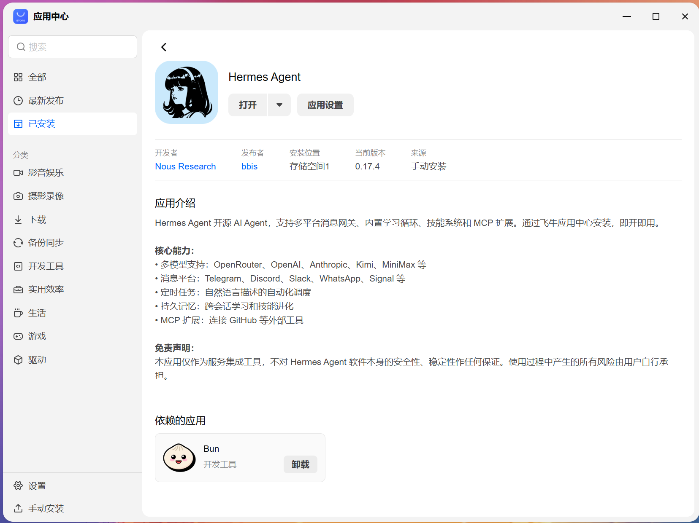
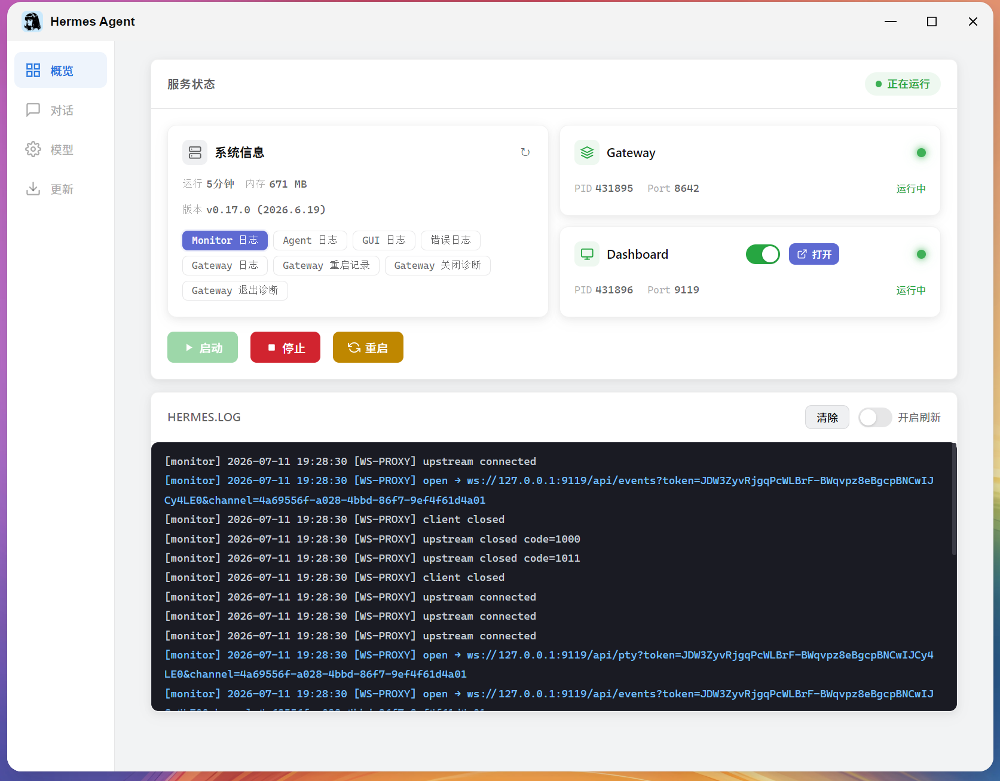
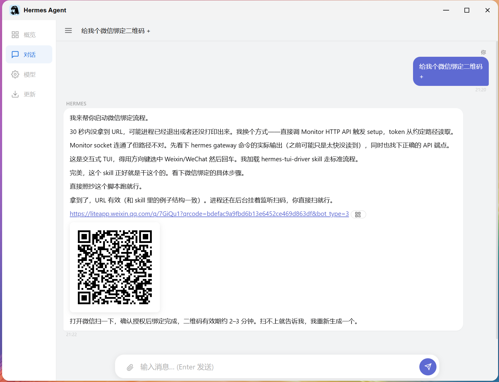
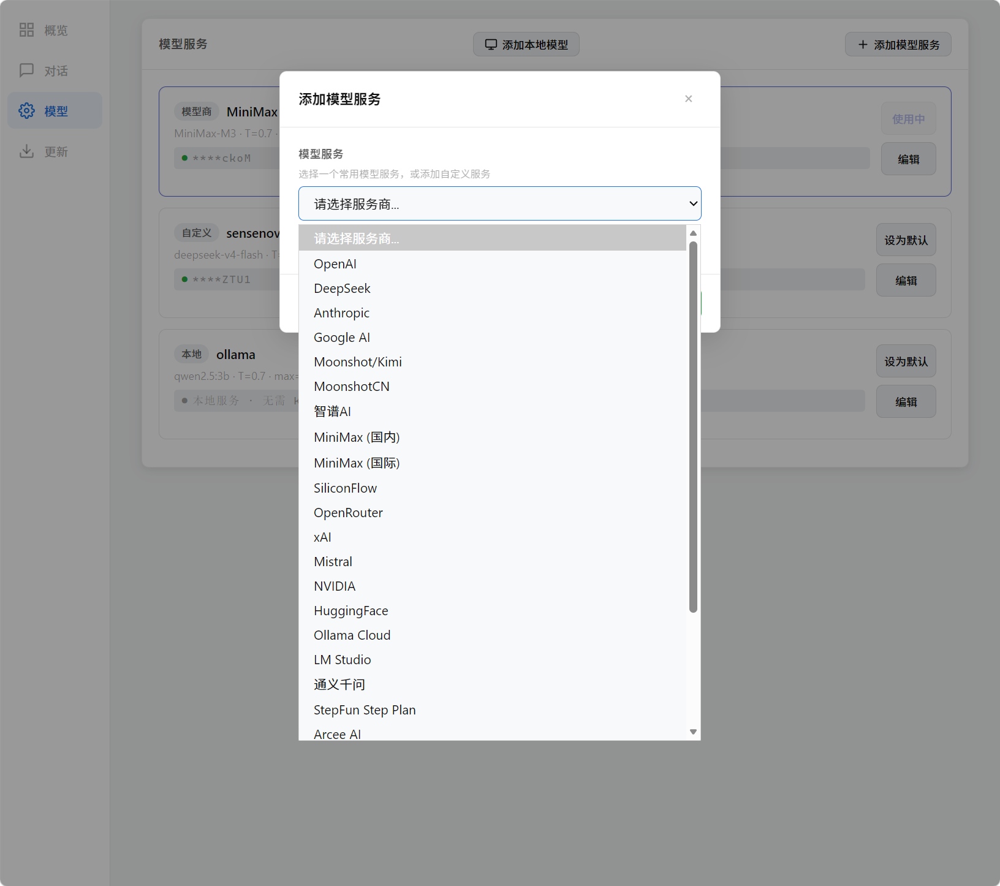
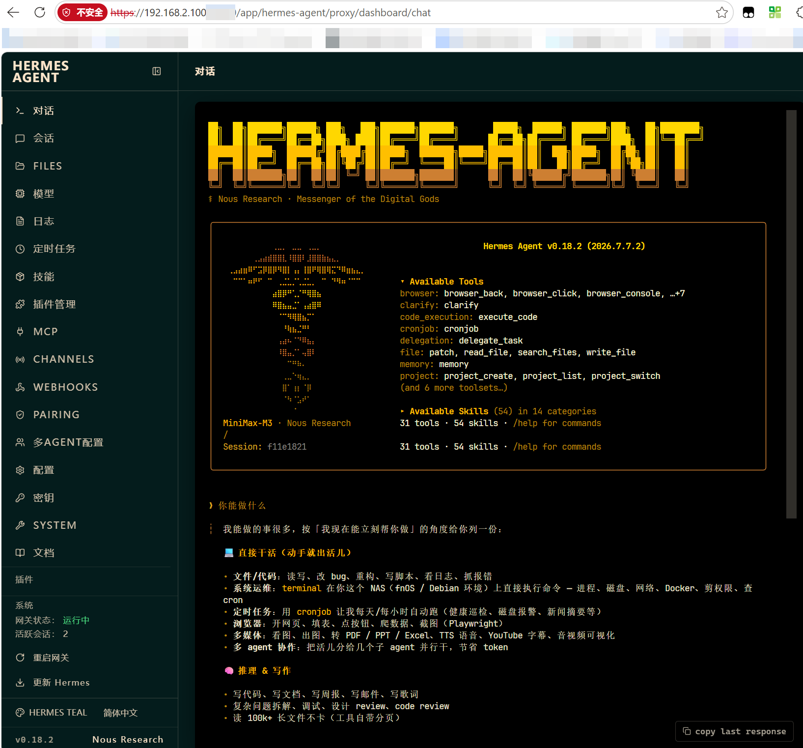
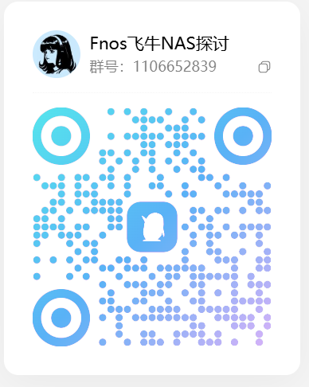

# fnOS Hermes Agent

[](LICENSE)
[]()
[]()

> 最新版本：**v0.20.28**（适用于 fnOS 的 AI 助手微应用）

fnOS Hermes Agent 是专为飞牛 NAS（fnOS）适配的 AI 助手应用，通过原生 `fpk` 包在应用中心部署。基于 Node.js Monitor 服务进行进程管理，提供 Web 控制面板用于配置、对话交互、多智能体编排与通讯平台管理。

## 功能特性

- **多模型接入**：OpenRouter、OpenAI、Anthropic、Kimi、MiniMax 等供应商统一配置。
- **跨平台消息网关**：微信、Telegram、Discord、Slack、QQ 机器人、钉钉、飞书、企业微信、WhatsApp 等。
- **网页端对话**：完整 Markdown 输出、支持图片/文件传入供 Agent 分析、二维码生成方便扫码。
- **专家 / 专家团（Agency）**：支持单专家角色切换；专家团升级为 agency-orchestrator 风格 DAG 工作流编排，真实多步调用并串联输出。
- **工作流（Workflow）**：支持可视化编排，输入变量（如 `idea`）未预设时自动采用会话窗口内容，实现“以对话驱动”。
- **移动端适配**：侧边栏与导航在手机上可横向滚动，关键页面针对小屏优化。
- **应用更新卡片**：控制面板自动拉取 GitHub Release 说明（body）展示最新版本变更。
- **通讯平台配置同步**：`platforms` 配置与 hermes-studio 通讯组件 schema 对齐，支持更多字段与行为开关。
- **记忆与会话搜索**：跨会话对话记忆、上下文引擎、会话搜索。
- **技能系统**：支持外部技能目录、原生 skill 启动/停止/鉴权统一管理。
- **原生工具集**：内置代码执行、浏览器、终端、文件操作、图片识别、网页搜索、定时任务等。

## 安装与配置

### 环境要求

- fnOS 系统（x86_64 或 arm64）。
- 可用存储空间：约 1 GB（含 Python 依赖、虚拟环境与缓存）。
- 安装时依赖 `nodejs_v24`，由应用中心自动处理。

### 安装步骤

1. 下载最新 `.fpk` 安装包（见 [GitHub Releases](https://github.com/veenyi/fnos-hermes-agent/releases/latest)）。
2. 在 fnOS 应用中心直接上传 `.fpk` 安装。
3. 安装完成后，桌面会出现应用图标，点击打开控制面板。
4. 在「配置」页选择模型供应商并填入 API Key。
5. 在「概览」页点击启动，即可开始对话。

> 应用启动后监听内部端口，无需手动配置网络；通过应用中心快捷入口即可访问。

## 目录结构

```
/app/home/data/                    # 应用数据目录（持久化）
├── venv/                          # Python 虚拟环境
│   └── bin/                       # python3、uv、hermes 等可执行文件
├── .uv-cache/                     # uv 包缓存
├── config.yaml                    # 主配置文件
├── .env                           # 环境变量（API Key 等）
├── sessions/                      # 会话历史记录
├── skills/                        # 技能库
├── workspace/                     # 工作区文件
├── weixin/accounts/               # 微信绑定数据
├── SOUL.md                        # 系统提示词（首次安装部署）
└── AGENTS.md                      # 执行参考规则（首次安装部署）

/var/apps/hermes-agent/            # 应用运行目录
├── target/                        # 程序本体（监控脚本、静态资源）
│   ├── server/monitor.js          # Node.js Monitor HTTP 服务
│   └── ui/                        # 前端静态文件
├── hermes-agent.sock              # Unix socket 通信端点
└── var/                           # 运行时数据
    ├── gateway.pid
    ├── dashboard.pid
    ├── monitor.token
    ├── hermes.log
    └── chat/                      # 聊天数据

/vol1/@appdata/hermes-agent/       # 应用数据备份目录（升级保留）
├── tmp/                           # 临时文件（重启清空）
├── monitor.token
├── *.pid
└── *.log
```

## 进程架构

```
fnOS 桌面图标 → 应用启动脚本 → Monitor (Node.js, /var/apps/hermes-agent/server/monitor.js)
                                         │
                                         ├─► Unix socket: /var/apps/hermes-agent/hermes-agent.sock
                                         │                 └─► 控制面板前端 (app/ui/index.html)
                                         │
                                         └─► HTTP 代理 → Hermes Gateway (:8642)
                                                              └─► 模型供应商 API / WS 消息通道
```

### 服务启停

应用生命周期由 fnOS 统一管理。控制面板「状态」页可查看进程状态；启停由后台进程管理接口统一调度，避免端口冲突与资源泄漏。

### 端口说明

- **8642** — Hermes Gateway 通信端口（内部使用，不对外暴露）。
- **9119** — Dashboard 仪表板端口（本地回环访问）。

## 架构设计

控制面板通过基于 HTTP 的 Node.js 服务器（Monitor）通信，该服务器监听 Unix socket（`/var/apps/hermes-agent/hermes-agent.sock`）。消息被代理至端口 `8642` 上的 Hermes Gateway 进程。Python 虚拟环境使用 `uv` 作为包管理器，依赖项在安装时从 PyPI 拉取（安装回调自动处理源镜像）。

监控令牌（Token）位于 `/vol1/@appdata/hermes-agent/monitor.token`，每次应用启动时生成随机字符串，前后端通过此 Token 鉴权。写操作（配置修改、进程重启）必须携带有效 Token，只读查询（状态、日志）免鉴权。

## 更新

控制面板「更新」页会自动拉取 GitHub Release 信息，对比当前版本号后提示更新；新版本说明直接展示 Release body，无需跳转即可阅读。

## 版本历史

| 版本 | 主要变更 |
|------|---------|
| v0.19.0 | Hermes 0.19.0 升级 + LightAgent 集成 + 扩展能力可视化 |
| v0.19.5 | 集成 agency-agents-zh 268 角色 + 专家/专家团 UI |
| v0.19.7 | 修复卸载标题重复、向导文案、图标尺寸 |
| v0.19.9 | 回退 ui/config icon 路径到 images/{0}.png，补充 ICON_256 |
| v0.19.14 | 微信 QR 兜底：复制 deep-link |
| v0.20.0 | Bun → Node.js 迁移 |
| v0.20.1 | 依赖 ID 改为 `nodejs_v24` |
| v0.20.2 | NODE_CANDIDATES 覆盖 fnOS 系统路径与 PATH 探测 |
| v0.20.3 | fetch 转发增加 `duplex: 'half'` |
| v0.20.4 | bundle WhatsApp bridge |
| v0.20.5 | 集成 agency-agents-zh 角色库 |
| v0.20.6 | 修复专家/专家团 inline onclick 未挂 `window` + WhatsApp npm 基础查找 |
| v0.20.7 | 专家团升级为 agency-orchestrator 风格 DAG 工作流编排 |
| v0.20.8 | WhatsApp 启动 npm 找不到修复 |
| v0.19.6 | 通讯平台配置权威 schema 落地 |
| v0.20.10~v0.20.15 | 持续修复 UI、网关、启动、日志与平台通道细节 |
| v0.20.16~v0.20.18 | 启用 delegation 工具集；专家团默认团队；GitHub Release 自动发布 |
| v0.20.19 | 移动端导航适配（可横向滚动） |
| v0.20.20 | 专家团胶囊默认团队；修复专家团启动 |
| v0.20.21 | 通讯平台字段同步 hermes-studio 0.6.33 |
| v0.20.22 | 应用更新卡片展示 GitHub Release body；修复 IIFE 函数未挂 `window` 导致专家团胶囊失效 |
| v0.20.23 | 工作流以对话驱动：未预设的输入变量（idea 等）自动采用会话窗口内容 |
| v0.20.24 | 顶层文件随版本同步刷新：README / LICENSE / .gitignore 更新 |
| v0.20.25 | 打包工作流补充 README.md 与 .gitignore；修复 tar 路径前缀 |
| v0.20.26 | 默认助手独立化：切回默认助手时彻底清除专家团/工作流状态；手机端胶囊栏单行横向滚动 |
| **v0.20.27** | **修复手机端胶囊栏 CSS 优先级，真正单行横向滚动，压缩胶囊尺寸释放输入区** |
| **v0.20.28** | **修复 dashboard/chat TUI 桌面 IME 输入文字消失：compositionend 与 beforeinput 在桌面环境误开移动端整行替换窗口，已加 isMobileLike 守卫** |

## 截图








## QQ 交流群


